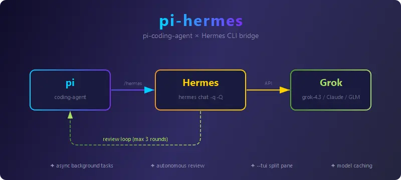

# permes

言語: 日本語 | [English](./README.md) | [简体中文](./README.zh-CN.md)



[pi-coding-agent](https://github.com/earendil-works/pi-coding-agent) 用の Experimental Hermes CLI ブリッジ拡張。

[Hermes Agent](https://github.com/nousresearch/hermes-agent) CLI にバックグラウンドでプロンプトを投げ、結果を pi に持ち込んで自律レビューする。

## 対象プラットフォーム

**Windows 11（ネイティブ）。** Windows 11 で開発・テストしている。Linux / macOS / WSL2 でも動く可能性があるが積極的にはテストしていない。

## クイックスタート

1. **Hermes Agent CLI をインストール** — [公式ガイド](https://github.com/nousresearch/hermes-agent#installation)に従う
2. **CLI の動作確認** — ターミナルで `hermes --version` を実行してバージョン番号が出ることを確認
3. **拡張をインストール**（下記 [インストール](#インストール) 参照）
4. **pi をリロード** — pi で `/reload` と入力後、`/permes hello` でテスト

## 前提条件

| 必要なもの | バージョン | 備考 |
|---|---|---|
| [pi-coding-agent](https://github.com/earendil-works/pi-coding-agent) | 最新 | この拡張が接続先 |
| [Hermes Agent CLI](https://github.com/nousresearch/hermes-agent) | ≥ 0.14 | `hermes` コマンドを提供 |
| Node.js | ≥ 18 | pi 自体が必要とする |

Hermes Agent は少なくとも1つのプロバイダー（例: `xai-oauth`）で設定されている必要がある。未設定の場合は `hermes auth` を実行。

## インストール

```bash
# ランタイムディレクトリを作成（モデルキャッシュ等を格納）
mkdir -p ~/.pi/agent/extensions/permes-bin

# 拡張ファイルをコピー
cp permes.ts ~/.pi/agent/extensions/permes.ts
```

その後 pi で `/reload` を実行。ステータスバーに拡張が読み込まれたことが表示される。

> **Windows ユーザー:** `~` は `C:\Users\<あなた>` に展開される。上記コマンドは Git Bash / PowerShell / cmd のいずれでも動作する。`hermes.exe` が PATH に入っていることを確認すること（通常は `%LOCALAPPDATA%\hermes\hermes-agent\venv\Scripts\hermes.exe`）。

## 使い方

```
/permes <message>                    # 前回と同じモデルで質問
/permes -m grok-4.3 <message>        # モデル指定
/permes -p xai-oauth <message>       # プロバイダー指定
/permes --tui <message>              # TUI ライブモード（Linux専用）
/permes --tui-wezterm-beta <message> # 実験的 WezTerm TUI（全OS）
/permes --status                     # 実行中タスク一覧
/permes --result <id>                # 完了タスクの結果取得
/permes --cancel <id>                # タスクをキャンセル
/permes --reset-model                # モデルキャッシュをクリア
```

- 初回のデフォルトモデル: `grok-4.3`
- 最後に使った `-m` / `-p` 値はキャッシュされ、次回以降の指定なし呼び出しで使われる
- タスクはバックグラウンドで実行 — Hermes が考えている間も pi は操作可能
- `--tui`（Linux専用）または `--tui-wezterm-beta`（実験的、WezTerm があれば全OS）で分割ペインにリアルタイム表示

## トラブルシューティング

| 問題 | 原因 | 対処 |
|---|---|---|
| `hermes: command not found` | Hermes CLI が PATH にない | Hermes Agent をインストール、または `bin` を PATH に追加 |
| `/reload` 後に拡張が読み込まれない | ファイルの場所が違う | `~/.pi/agent/extensions/permes.ts` が存在するか確認 |
| タスクがタイムアウトする | Hermes CLI がフリーズしたかモデルが利用不可 | ターミナルで `hermes chat -q "test" -m grok-4.3 -Q` を直接実行して確認 |
| `permes-review` が "Task not found" | taskId が間違っているか期限切れ | `/permes --status` で正しいタスク ID を確認 |
| モデルが見つからないエラー | モデル名のtypo または利用不可 | `hermes --help` で利用可能なモデルを確認 |

## アーキテクチャ

### CLI モード（デフォルト）

```
/permes <message>
  │
  ├─ hermes chat -q -Q "msg" -m model
  │   └─ CLI出力からセッションID + 応答テキストを抽出
  │
  ├─ pi が応答を自律レビュー
  │   ├─ OK → 完了
  │   └─ エラー → permes-review ツール
  │       └─ hermes -z "feedback" --resume <session_id>
  │
  └─ 最大3回のレビューラウンド、解決しない場合はユーザーに報告
```

### TUI モード（`--tui`）— Linux 専用

WezTerm が必要。分割ペインに hermes chat を起動し、セッションファイルをポーリングして完了を検知。

```
/permes --tui <message>
  │
  ├─ WezTerm 分割ペインで hermes chat を起動
  │
  ├─ セッションファイルをポーリング（8秒間変化なしで完了判定）
  │
  ├─ セッション JSON から最後のアシスタントメッセージを読み取り
  │
  └─ pi に結果を注入（CLI モードと同じレビューループ）
```

### WezTerm ベータモード（`--tui-wezterm-beta`）— 実験的

WezTerm がインストールされ `wezterm cli` が使える環境なら、OSを問わず動作。
セッションファイルのポーリングは `--tui` と同じ。Windows では WezTerm 内で実行してください。

```
/permes --tui-wezterm-beta <message>
```

非対応環境では警告して終了。

単一ファイル: `permes.ts` — ビルド不要。pi のバンドル済み拡張ランタイム依存関係（`typebox` を含む）を使用。

## 既知の問題

[Issues](https://github.com/na-navi/permes/issues) を参照。

## ライセンス

MIT
